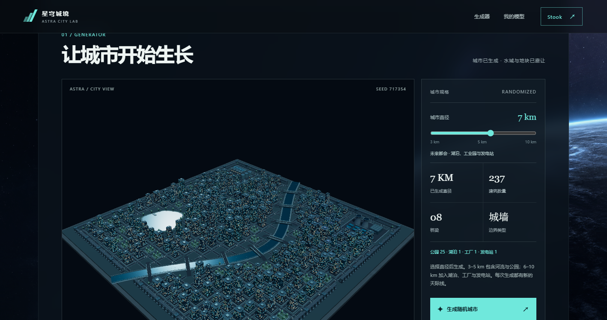
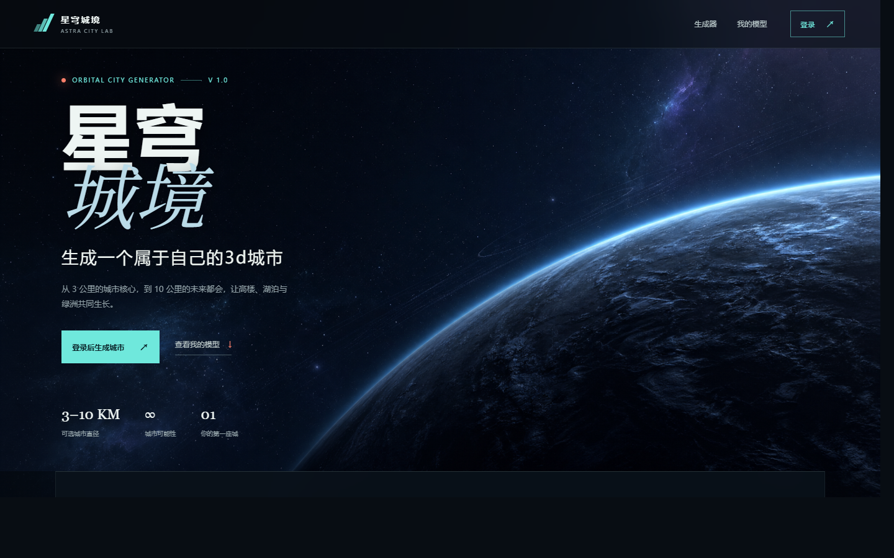

# 星穹城境 · 3D 城市生成器

[](https://stook-404.github.io/starry-sky-city/)
[](LICENSE)
[](https://threejs.org/)

> ### ▶ [**点此在线试玩**](https://stook-404.github.io/starry-sky-city/)
> 无需安装、无需后端，浏览器打开即可生成属于你的 3D 城市。



*上图由线上站点实时生成：直径 7 km，237 栋建筑，8 座桥，含湖泊、河流、公园与工业设施。*

## 界面



一个纯前端、程序化生成的 3D 城市生成器。使用本地 Three.js 做真实 3D 渲染，
不依赖任何服务端 —— 打开网页即可生成城市。

## 快速开始

直接用浏览器打开 `index.html`，或启动一个静态服务器：

```bash
python -m http.server 8000
# 然后访问 http://localhost:8000
```

首次点击「登录」设置一个称呼，登录后点击「生成随机城市」。

## 功能

- **城市直径 3–10 km 可调**，直径变化会实际扩大用地、街区和城市边界
- **分级内容生成**
  - 3–5 km：高楼、随机弯曲河流、桥梁、公园与随机边界
  - 6–7 km：增加湖泊、工业园和发电站
  - 8–10 km：增加到两片湖泊
- **建筑细节**：倒角、贴合斜面的幕墙、退台、屋顶设备
- **边界材质**：混凝土、金属护板或自然地形
- **用地避让**：建筑用地会避开河流、湖岸、桥头和工业设施
- **3D 设施几何**：湖岸绿化、厂房、储罐、冷却塔、太阳能阵列
- **视角操作**：拖动旋转，滚轮缩放，右键拖动或 Shift + 拖动平移；
  「全景」「俯瞰」「近景」按钮一键切换
- **本地存档**：保存按钮会把城市布局、随机种子和直径记在浏览器本地存储中

## 操作说明

| 操作 | 方式 |
|---|---|
| 旋转视角 | 拖动鼠标 |
| 缩放 | 滚轮 |
| 平移 | 右键拖动 / Shift + 拖动 |
| 切换视角 | 全景 / 俯瞰 / 近景 按钮 |

## 运行要求

浏览器需支持 **WebGL**。无法启动时会显示提示，不会退化为二维模拟城市。

城市模型只保存在当前浏览器的本地存储中，**不会上传到网络**。

## 开发检查

```bash
node tests/city-model.test.cjs
```

## 目录结构

```
index.html                  入口页面
styles.css                  样式
app.js                      应用与交互逻辑
city-model.js               城市生成模型（核心算法）
three-bridge.js             Three.js 桥接层
assets/hero-planet.png      主视觉图
vendor/three.*.min.js       本地 Three.js（离线可用）
tests/city-model.test.cjs   模型测试
使用说明.txt                 原始使用说明
```

## 第三方组件

`vendor/` 目录内含 [Three.js](https://threejs.org/)，遵循其 MIT 许可证。

---

## 许可证

本项目采用 [MIT 许可证](LICENSE)。

`vendor/` 目录内含 [Three.js](https://threejs.org/)，版权归 Three.js Authors
所有，同样以 MIT 许可证授权：

> Copyright © 2010-2026 three.js authors
>
> Permission is hereby granted, free of charge, to any person obtaining a copy
> of this software and associated documentation files (the "Software"), to deal
> in the Software without restriction, including without limitation the rights
> to use, copy, modify, merge, publish, distribute, sublicense, and/or sell
> copies of the Software, and to permit persons to whom the Software is
> furnished to do so, subject to the following conditions:
>
> The above copyright notice and this permission notice shall be included in
> all copies or substantial portions of the Software.
